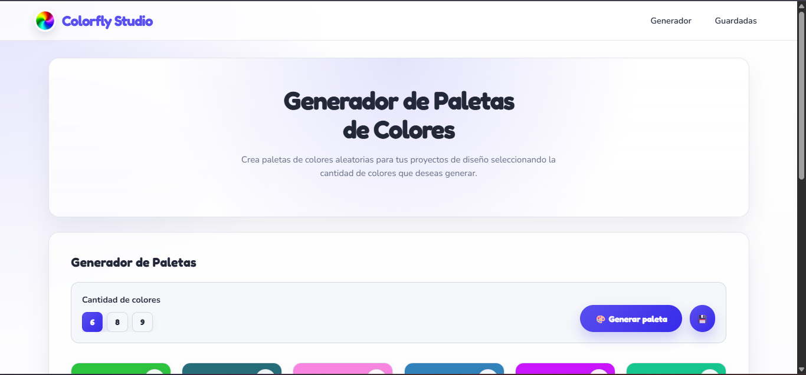
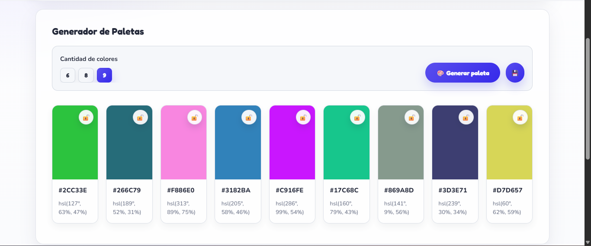
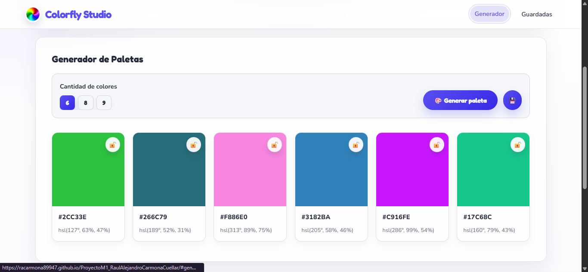
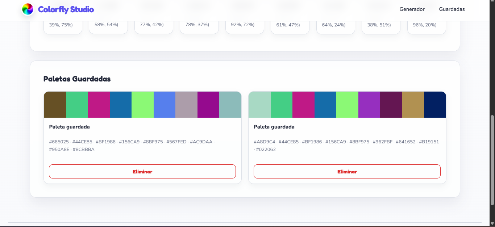
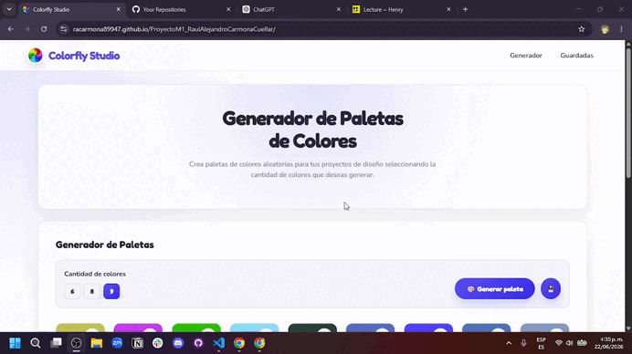

# Colorfly Studio — Generador de Paletas de Colores

**Proyecto Integrador del Módulo 1 — Desarrollo Web (HTML, CSS, JavaScript)**  
Autor: *Raul Alejandro Carmona Cuellar*

> Demo GitHub Pages: https://racarmona89947.github.io/ProyectoM1_RaulAlejandroCarmonaCuellar/

---

## ✨ ¿Qué hace?

Colorfly Studio es una aplicación **100% frontend** que permite crear paletas de colores aleatorias de forma interactiva.

Incluye:
- Generar paletas (6, 8 o 9 colores)
- **Bloquear** colores para que no cambien en regeneraciones
- **Copiar** un color HEX al portapapeles con clic
- **Guardar** paletas en el navegador (localStorage)
- Eliminar paletas guardadas

---

## 🗂️ Capturas (docs/)

### Flujo principal de la app

- Captura 1: 


- Captura 2: 


- Captura 3: 


- Captura 4: 


- GIF del flujo:

  


### IA / prompts (documentación)

---

- Archivo con prompts usados (agente + chat): [ia-docs.md](ia-docs.md)

---

- Ejemplo prompt: 
  
  
- Capturas de respuestas prompts:
  
  

  

  

  

  

  

---


## 🧭 Instrucciones de uso

### 🎨 Generar paleta
1. Selecciona la cantidad de colores (**6**, **8** o **9**)
2. Presiona **“Generar paleta”**
3. La paleta se crea automáticamente

### 🔒 Bloquear colores
- Cada color tiene un botón 🔓/🔒
- Si está bloqueado, **no cambia** al generar una nueva paleta

### 📋 Copiar colores (HEX)
- Haz clic sobre el color
- Se copia su valor HEX al portapapeles

### 💾 Guardar paletas
- Botón 💾 guarda la paleta en `localStorage`
- Se muestran en la sección “Guardadas”
- Puedes eliminar paletas desde esa sección

---

## ⚙️ Decisiones técnicas

### 🧱 Tecnologías usadas
- HTML → estructura
- CSS → estilos, Grid, Flexbox, responsive
- JavaScript → lógica de la aplicación

### 📋 Portapapeles (clipboard)
Se usa la API del navegador:

```js
navigator.clipboard.writeText(hexColor)
```

> Nota: algunos navegadores pueden bloquear `clipboard` si no hay interacción del usuario o si el contexto no es seguro.

### 💾 Persistencia en el navegador (localStorage)
- Las paletas guardadas se almacenan bajo la key: **`savedPalettes`**
- Valor: arreglo en JSON de paletas, donde cada paleta es un arreglo de HEX

### 📱 Responsive y adaptación de UI (CSS)
El diseño se trabajó para que la interfaz sea usable en escritorio, tablet y móvil mediante **media queries**:
- `@media (max-width: 1024px)`: ajustes de layout en los controles (por ejemplo, scroll horizontal cuando hace falta).
- `@media (max-width: 768px)`: reducción de espacios/tamaños, ajuste del nav, y cambio de la grilla.
- `@media (max-width: 430px)`: optimización fina para pantallas pequeñas (tamaños de botones, grid y componentes).

Además, se consideró la preferencia del usuario con `@media (prefers-reduced-motion: reduce)` para evitar animaciones cuando sea necesario.

> Nota: estas configuraciones de responsive/UX fueron tomadas y adaptadas a partir de patrones usados en proyectos previos de forma profesional.

### 🧠 Adaptaciones de UX y accesibilidad (JavaScript)
La lógica en JavaScript fue estructurada para mejorar la experiencia de uso y la interacción:
- Scroll suave hacia secciones con `scrollIntoView({ behavior: "smooth" })`.
- Interacciones con teclado (ej. `keydown` en el área de copiar HEX) además del click.
- Uso de atributos ARIA como `aria-label` y `tabindex` para apoyar navegación y comprensión.

> Nota: la base de estas decisiones (manejo de interacciones/UX) también proviene de prácticas usadas en proyectos previos y fue adaptada al contexto de esta aplicación.

---

## 📁 Estructura del proyecto

```text
ProyectoM1_RaulAlejandroCarmonaCuellar/
├── assets/
│   └── icons/
│       └── images-Photoroom.png
├── css/
│   └── styles.css
├── js/
│   └── script.js
├── docs/
│   ├── capturas-flujo-principal-app/
│   │   ├── 1.png
│   │   ├── 2.png
│   │   ├── 3.png
│   │   ├── 4.png
│   │   └── flujo.gif
│   └── capturas-ia-respuestas/
│       ├── ejemplo prompt.png
│       ├── prompt 1.png
│       ├── prompt 2.png
│       ├── prompt 3.png
│       ├── prompt 4.png
│       ├── prompt 5.png
│       └── prompt 6.png
├── ia-docs.md
├── index.html
└── README.md
```

---

## 📥 Cómo clonar el repositorio

```bash
git clone https://github.com/racarmona89947/ProyectoM1_RaulAlejandroCarmonaCuellar.git
```
```bash
cd ProyectoM1_RaulAlejandroCarmonaCuellar
```

### Alternativa: ZIP
- GitHub → Code → Download ZIP
- Descomprime y abre la carpeta

---

## ▶️ Ejecución en local

Requisitos:
- Navegador moderno (Chrome, Firefox, Edge)
- VS Code (opcional)

Opción 1 (rápida):
- Abre `index.html` con doble clic

Opción 2 (recomendada): Live Server
- Abre el proyecto en VS Code
- Instala la extensión **Live Server**
- Click derecho en `index.html` → **Open with Live Server**

---

## 🚀 Despliegue en GitHub Pages

Pasos:
1. Subir el proyecto al repositorio
2. Settings → Pages
3. Configurar:
   - Branch: `main`
   - Folder: `/ (root)`
4. Guardar

GitHub generará una URL pública automáticamente.

---

**Proyecto desarrollado como parte del curso de Desarrollo Full Stack en Soy Henry**

